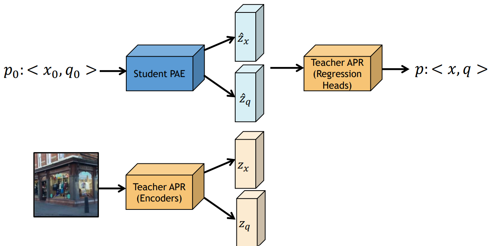
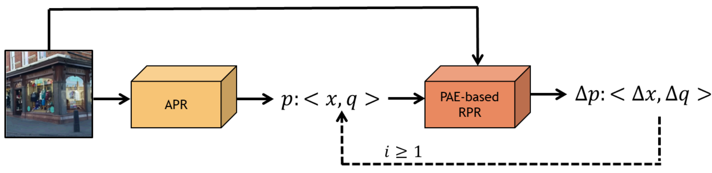
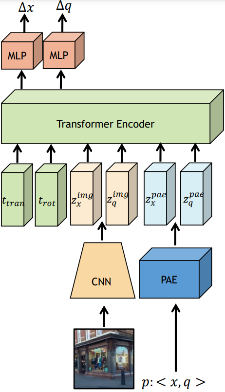

## Camera Pose Auto-Encoders (PAEs)
### Overview 
This repository provides an official implementation for:
- [Camera Pose Auto-Encoders](https://arxiv.org/abs/2207.05530) (PAEs), _accepted to ECCV 2022_
- Iterative Absolute Pose Regression (iAPR), which extends our ECCV22 work,
a new class of APRs, combining absolute pose regression and relative pose regression, _without_ extra image or pose storage.

### Introduction
**Camera Pose Auto-Encoders (PAEs)** are multi-layer perceptrons (MLPs), trained via a Teacher-Student approach
to encode camera poses, using Absolute Pose Regressors (APRs) as their teachers (Fig. 1). 
Once trained, PAEs can closely reproduce their teachers' performance, 
across outdoor and indoor environments and when learning from multi- and single- scene APR teachers 
with different architectures. 
 <p align="center">
  
 </p>
 <p align = "center">
Fig. 1: Training PAEs
</p>
 
Below we provide instructions for running our code in order to train teacher APRs and student PAEs 
and for evaluating them. We also provide pre-trained models.

Once a PAE is trained, we can use it to as a means for extending pose regression with visual and spatial
information at a minimal cost. 

**Iterative Absolute Pose Regression** (iAPR) is a new class of APRs, which combines absolute 
pose regression and relative pose regression, _without_ additional image or pose storage. Specifically, it applies 
a PAE-based RPR on the initial APR estimate for one or more iterations (Fig. 2). iAPR achieves a new state-of-the-art 
(SOTA) localization accuracy for APRs on the 7Scenes dataset, _even when trained with only 30% of the data_.

 <p align="center">
  
 </p>
 <p align = "center">
Fig. 2: Our proposed iAPR method, combining absolute pose regression with PAE-based
relative pose regression.
</p>

As for PAEs, we provide instructions for training and testing our iAPR model. 

### Prerequisites
In order to run this repository you will need:

1. Python3 (tested with Python 3.7.7)
1. PyTorch deep learning framework (tested with version 1.0.0)
1. Download the [Cambridge Landmarks](http://mi.eng.cam.ac.uk/projects/relocalisation/#dataset) dataset and the [7Scenes](https://www.microsoft.com/en-us/research/project/rgb-d-dataset-7-scenes/) dataset
1. You can also download pre-trained models to reproduce reported results (see below)
1. For a quick set up you can run: pip install -r requirments.txt 
Note: All experiments reported in our paper were performed with an 8GB 1080 NVIDIA GeForce GTX GPU


### PAEs
#### Training and Testing Teacher APRs
Our code allows training and testing of single-scene and multi-scene APR teachers.
Specifically, we use PoseNet with different CNN backbones as our single-scene APRs and 
MS-Transformer as our multi-scene APR. 

For example, in order to train PoseNet with EfficientNet-B0 on the KingsCollege scene, run:
```
python main_train_test_apr.py posenet train models/backbones/efficient-net-b0.pth
<path to the CambridgeLandmarks dataset>
datasets/CambridgeLandmarks/abs_cambridge_pose_sorted.csv_KingsCollege_train.csv
CambridgeLandmarks_config.json
```
In order to train with a different backbone, change the path to the backbone (third argument)
and the value of 'backbone_type', under the 'posenet' dictionary, in the json configuraion file. 
We support MobileNet and ResNet50. 

After training, you can test your trained model by running:
```
python main_train_test_apr.py posenet test models/backbones/efficient-net-b0.pth <path to the CambridgeLandmarks dataset> datasets/CambridgeLandmarks/abs_cambridge_pose_sorted.csv_KingsCollege_test.csv
CambridgeLandmarks_config.json --checkpoint_path posenet_effnet_apr_kings_college.pth
```
In order to train and test **MS-Transformer**, please follow the instructions 
at our [MS-Transformer repository](https://github.com/yolish/multi-scene-pose-transformer)

#### Training and Testing Student PAEs
##### Single-scene PAEs
To train a single-scene PAE with a PoseNet Teacher (with an EfficientNet-B0 backbone), run 
the following command, using the same configuration used for the teacher APR:
```
python main_learn_pose_encoding.py posenet train models/backbones/efficient-net-b0.pth
<path to dataset> datasets/CambridgeLandmarks/abs_cambridge_pose_sorted.csv_KingsCollege_train.csv
CambridgeLandmarks_config.json posenet_effnet_apr_kings_college.pth
```
You can then evaluate it and compare it to its teacher, by running:
```
python main_learn_pose_encoding.py posenet test models/backbones/efficient-net-b0.pth
<path to dataset> datasets/CambridgeLandmarks/abs_cambridge_pose_sorted.csv_KingsCollege_test.csv CambridgeLandmarks_config.json posenet_effnet_apr_kings_college.pth
--encoder_checkpoint_path posenet_effnet_apr_kings_college.pth
```
##### Multi-scene PAEs
Similarly, you can train a multi-scene PAE with MS-Transformer.
For example, training on the 7Scenes dataset:
```
python main_learn_multiscene_pose_encoding.py
ems-transposenet
train
models/backbones/efficient-net-b0.pth
<path to dataset>
datasets/7Scenes/7scenes_all_scenes.csv
7scenes_config.json 
ems_transposenet_7scenes_pretrained.pth
```
and then evaluate it by running: 
```
python main_learn_multiscene_pose_encoding.py
ems-transposenet
test
/models/backbones/efficient-net-b0.pth
<path to dataset>
datasets/7Scenes/abs_7scenes_pose.csv_fire_test.csv
7scenes_config.json
ems_transposenet_7scenes_pretrained.pth
--encoder_checkpoint_path 
mstransformer_7scenes_pose_encoder.pth
```

#### Pre-trained Models
| Model (Linked) | Description | 
--- | ---
| APR models ||
[PoseNet+MobileNet](https://drive.google.com/file/d/1YMbWCCnu1pQI-ni4v0y_Lo8EpFumwqHI/view?usp=sharing) | Single-scene APR, KingsCollege scene|
[PoseNet+ResNet50](https://drive.google.com/file/d/1afA97MG5tGfFLBTwaAbauT2-H0tFJxaj/view?usp=sharing}) | Single-scene APR, KingsCollege scene|
[PoseNet+EfficientB0](https://drive.google.com/file/d/1FdaAFfDtN-XxWl3Ek281Ca_wlerqnBOF/view?usp=sharing) | Single-scene APR, KingsCollege scene|
[MS-Transformer](https://drive.google.com/file/d/1ZEIKQSbZmkSnJwETjACvMbs5OeCn7f3q/view?usp=sharing) | Multi-scene APR, CambridgeLandmarks dataset|
[MS-Transformer](https://drive.google.com/file/d/1Ryn5oQ0zRV_3KVORzMAk99cP0fY2ff85/view?usp=sharing) | Multi-scene APR, 7Scenes dataset|
| Camera Pose Auto-Encoders||
[Auto-Encoder for PoseNet+MobileNet](https://drive.google.com/file/d/1EhGmMMCOlFK3lirYlintw0DEJtRGr3eR/view?usp=sharing) | Auto-Encoder for a single-scene APR, KingsCollege scene|
[Auto-Encoder for PoseNet+ResNet50](https://drive.google.com/file/d/1nZolEHF_TKDHpBEw7YQhxH4w61HL0oGD/view?usp=sharing) | Auto-Encoder for a single-scene APR, KingsCollege scene|
[Auto-Encoder for PoseNet+EfficientB0](https://drive.google.com/file/d/1zvHBt5bGB2v59_ONWwLmh8NNUNVdh03T/view?usp=sharing) | Auto-Encoder for a single-scene APR, KingsCollege scene|
[Auto-Encoder for MS-Transformer](https://drive.google.com/file/d/1rshdruRQcZYMIRI9lTY_U981cJsohauI/view?usp=sharing) | Auto-Encoder for a multi-scene APR, CambridgeLandmarks dataset|
[Auto-Encoder for MS-Transformer](https://drive.google.com/file/d/1hGcII8D0G24DBGXh3aLohCubAmfN9Rc7/view?usp=sharing) | Auto-Encoder for a multi-scene APR, 7Scenes dataset|


### iAPR
#### Training and Testing
We propose a PAE-based RPR model (Fig. 3) to estimate the relative motion between 
an encoded pose and a query image.
 <p align="center">
  
 </p>
 <p align = "center">
Fig. 3: Our proposed PAE-based RPR architecture, for implementing iAPR.
</p>

In order to train our model, run:
```
python main_iapr.py train <path to dataset> 7scenes_training_pairs.csv
7scenes_iapr_config.json pretrained_models/ems_transposenet_7scenes_pretrained.pth
models/backbones/efficient-net-b0.pth pretrained_models/mstransformer_7scenes_pose_encoder.pth 
```
Note: links to data are available below. 

In order to test iAPR with our model, for example with the chess scene, run:
```
python main_iapr.py test <path to dataset> datasets/7Scenes/abs_7scenes_pose.csv_chess_test.csv
7scenes_iapr_config.json pretrained_models/ems_transposenet_7scenes_pretrained.pth
models/backbones/efficient-net-b0.pth pretrained_models/mstransformer_7scenes_pose_encoder.pth 
--checkpoint_path <path to iapr model>             
```
You can change the number of iterations in the configuration file. Pretrained models are available below.

our iAPR achieves SOTA performance on the 7Scenes dataset and improves performance 
even when trained on a much smaller subset of the training data.

The following table shows the pose error (in meters/degrees) of MS-Transformer and iAPR, for the 
7Scenes dataset, when training with 100%, 70%, 50%
and 30% of the train set:

| % of training data | MS-Transformer | iAPR |
----------------------| --------------| ----|
| 100%               | 0.18m / 7.28deg | 0.17m / 6.69deg 
| 70%                | 0.19m / 7.41deg | 0.18m / 7.10deg |
| 50%                | 0.19m / 7.73deg | 0.18m / 6.89deg |
| 30%               | 0.20m / 8.19deg | 0.19m / 7.12deg |
#### Data 
| Data (linked)                                                                  | Description |
|--------------------------------------------------------------------------------|-------------|
| [7Scenes training 100p](datasets/7Scenes/7scenes_all_scenes.csv)               | 100% of the training images|
| [7Scenes training 70p](datasets/7Scenes/7scenes_all_scenes.csv_0.7_subset.csv) | 70% of the training images|
| [7Scenes training 50p](datasets/7Scenes/7scenes_all_scenes.csv_0.5_subset.csv) | 50% of the training images|
| [7Scenes training 30p](datasets/7Scenes/7scenes_all_scenes.csv_0.3_subset.csv) | 30% of the training images|
| [7Scenes training pairs-100p](https://drive.google.com/file/d/1vpPU4BPDwOrwj0OsHXXoqFXDGVKyzbPV/view?usp=sharing)                                                | Training pairs generated from 100% of the training images|
| [7Scenes training pairs-70p](https://drive.google.com/file/d/1aAIsZL_lQNgTBbKEcpc7ia8sUVuYSnnL/view?usp=sharing)                                                 | Training pairs generated from 70% of the training images|
| [7Scenes training pairs-50p](https://drive.google.com/file/d/19BHlRfVhcGxaZnql0AfFzfpM8e6po2Om/view?usp=sharing)                                                 | Training pairs generated from 50% of the training images|
| [7Scenes training pairs-30p](https://drive.google.com/file/d/1cKhqoTEcSiXo5sXQOXIu0OFV8KesA-jx/view?usp=sharing)                                                 | Training pairs generated from 30% of the training images|

#### Pre-trained Models 
| Model (linked)                                                                                 | Description                                                                               |
|------------------------------------------------------------------------------------------------|-------------------------------------------------------------------------------------------|
| [iAPR-100p](https://drive.google.com/file/d/1VrFBHfx8eJP3KOrV0c61WWCiS8zpV3SZ/view?usp=sharing)                                                                                  | iAPR Model trained with 100% of 7Scenes dataset                                           |
| [PAE-100p](https://drive.google.com/file/d/1hGcII8D0G24DBGXh3aLohCubAmfN9Rc7/view?usp=sharing) | PAE Model trained with 100% of 7Scenes dataset (original MS-PAE model, available above)   |
| [MS-100p](https://drive.google.com/file/d/1Ryn5oQ0zRV_3KVORzMAk99cP0fY2ff85/view?usp=sharing)  | MS-Transformer Model trained with 100% of 7Scenes dataset (original MS-Transformer model) |
| [iAPR-70p](https://drive.google.com/file/d/1gtDRDhn9SPeOkJmSEKOdTaTV8n5zeLl-/view?usp=sharing)                                                                                   | iAPR Model trained with 70% of 7Scenes dataset                                            |
| [PAE-70p](https://drive.google.com/file/d/1_OwVKwpoR5CbTtTHHmaHqzLAR7a4QvCF/view?usp=sharing)  | PAE Model trained with 70% of 7Scenes dataset                                             |
| [MS-70p](https://drive.google.com/file/d/134Xp_76gU8hoHV1CUW_kWT4D6M2moRkl/view?usp=sharing)   | MS-Transformer Model trained with 70% of 7Scenes dataset                                  |
| [iAPR-50p](https://drive.google.com/file/d/1VrFBHfx8eJP3KOrV0c61WWCiS8zpV3SZ/view?usp=sharing)                                                                                   | iAPR Model trained with 50% of 7Scenes dataset                                            |
| [PAE-50p](https://drive.google.com/file/d/1W_mNFuwAAVInKvYtzQX2g_hbDCbxcb3W/view?usp=sharing)  | PAE Model trained with 50% of 7Scenes dataset                                             |
| [MS-50p](https://drive.google.com/file/d/1cuaLkTYh2XYnZwlCEsuRC-7UVyRid_6a/view?usp=sharing)   | MS-Transformer Model trained with 50% of 7Scenes dataset                                  |
| [iAPR-30p](https://drive.google.com/file/d/1Mk96h4TgxdXUCo9d2-nqRmuCNh7hdhF2/view?usp=sharing)                                                                                   | iAPR Model trained with 30% of 7Scenes dataset                                            |
| [PAE-30p](https://drive.google.com/file/d/1cHmdHGGQtQm1O4rezLZuAxOlZK8aeWg1/view?usp=sharing)  | PAE Model trained with 30% of 7Scenes dataset                                             |
| [MS-30p](https://drive.google.com/file/d/1ApbfmkqMryLuxbX_n1ZLbD9MhfJBGBT2/view?usp=sharing)   | MS-Transformer Model trained with 30% of 7Scenes dataset                                  |


### Other Applications of PAEs
#### Decoding Images from Encoded Train Poses
To train an image decoder for a PAE for the ShopFacade scene:
```
python main_reconstruct_img.py train <path to cambridge dataset>
datasets/CambridgeLandmarks/abs_cambridge_pose_sorted.csv_ShopFacade_train.csv
reconstruct_config.json pretrained_models/mstransformer_cambridge_pose_encoder.pth
```
To test our Decoder (decoding the _train_ images for their PAE encoded poses):
```
python main_reconstruct_img.py
demo <path to cambridge dataset> datasets/CambridgeLandmarks/abs_cambridge_pose_sorted.csv_ShopFacade_train.csv
reconstruct_config.json pretrained_models/mstransformer_cambridge_pose_encoder.pth
--decoder_checkpoint_path pretrained_models/img_decoder_shop_facade.pth
```

You can download the pre-trained ShopFacade decoder from [here](https://drive.google.com/file/d/1okm_sN_JXrSD2bpTHBYDghl99pIj87YX/view?usp=sharing) 

